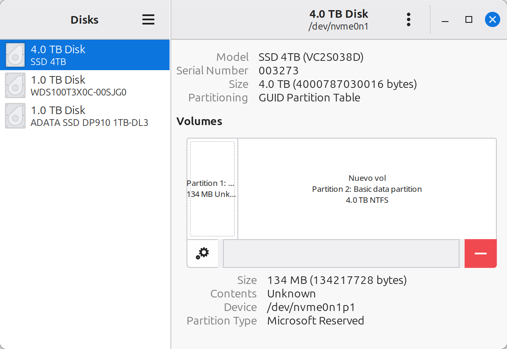

# WD Black SN850X NVMe SSD

[Specification@sandisk](https://documents.sandisk.com/content/dam/asset-library/en_us/assets/public/sandisk/product/internal-drives/wd-black-ssd/data-sheet-wd-black-sn850x-nvme-ssd.pdf)

It is supposed to a WD Black SN850X NVMe SSD with 4TB without heatsink, according to the specification above, that would correspond to the model "WDS400T2X0E":

PCIe Gen4 up to 4 lanes

|||
|:--- | ---: |
|Sequential Read | 7300 MB/s |
|Sequential Write | 6600 MB/s |
|Random Read | 1200 IOPS |
|Random Write | 1100 IOPS |

## Analysis

arrived: 2026-04-21

## Readonly Tests

GPT formatted disk with 3.64 TiB in two windows partitions (128 MB, 4.6 TB).

```bash
# fdisk -l 
Disk /dev/nvme0n1: 3.64 TiB, 4000787030016 bytes, 7814037168 sectors
Disk model: SSD 4TB                                 
# [...]
Disklabel type: gpt
# [...]
Device          Start        End    Sectors  Size Type
/dev/nvme0n1p1     34     262177     262144  128M Microsoft reserved
/dev/nvme0n1p2 264192 7814035455 7813771264  3.6T Microsoft basic data

```
[fdisk -l full output](20-fdisk-l.txt)


Among other things the graphical Disk Utility shows "Nuevo vol" as disk label for the second partition.


```bash
$> nvme list

Node          Generic     SN            Model               Namespace  Usage              Format          FW Rev  
------------- ----------- ------------- ------------------- ---------- ------------------ --------------- ---------
/dev/nvme0n1  /dev/ng0n1  003273        SSD 4TB             0x1        4.00 TB / 4.00 TB  512   B +  0 B  VC2S038D
/dev/nvme1n1  /dev/ng1n1  190xxxxxxxxx  WDS100T3X0C-00SJG0  0x1        1.00 TB / 1.00 TB  512   B +  0 B  102000WD
```
[nvme list complete output](40-nvme_list.txt)

```bash
$> nvme smart-log /dev/nvme0n1 --human-readable
# [...]
Data Units Read				: 15911282 (8.15 TB)
Data Units Written			: 28551512 (14.62 TB)
host_read_commands			: 517911575
host_write_commands			: 342685492
controller_busy_time		: 862
power_cycles				: 23
power_on_hours				: 4987
# [...]
```
[nvme smart-log full output](60-nvme_smart-log_--human-readable.txt)

After readonly mounting the filysystem of the big partition it shows a subfolder: `SteamLibrary`

## Performance

```bash
# buffered reads:
$> sudo hdparm -t /dev/nvme0n1
/dev/nvme0n1:
 Timing buffered disk reads: 172 MB in  3.04 seconds =  56.64 MB/sec
 Timing buffered disk reads: 202 MB in  3.08 seconds =  65.56 MB/sec
 Timing buffered disk reads: 150 MB in  3.04 seconds =  49.39 MB/sec
 Timing buffered disk reads: 144 MB in  3.06 seconds =  47.11 MB/sec

$> sudo time dd if=/dev/nvme0n1 of=/dev/null bs=1M count=1k seek=6000 >> 80-dd-if_nvme0n1.txt
1024+0 records in
1024+0 records out
1073741824 bytes (1.1 GB, 1.0 GiB) copied, 44.0501 s, 24.4 MB/s
0.01user 1.05system 0:44.05elapsed 2%CPU (0avgtext+0avgdata 2788maxresident)k
2097408inputs+0outputs (0major+358minor)pagefaults 0swaps

# Compared to a WD Black SN750:
$> sudo hdparm -t /dev/nvme1n1
/dev/nvme1n1:
 Timing buffered disk reads: 3562 MB in  3.00 seconds = 1186.09 MB/sec

$> sudo time dd if=/dev/nvme1n1 of=/dev/null bs=1M count=1k seek=6000 >> 80-dd-if_nvme0n1.txt
1073741824 bytes (1.1 GB, 1.0 GiB) copied, 0.194611 s, 5.5 GB/s
```
