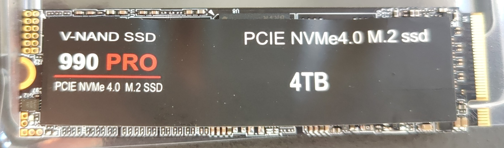
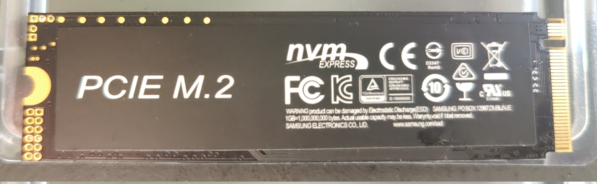

# 990 Pro (4TB)

Labeled: V-NAND SSD 990 PRO - PCIE NVMe4.0 M.2 ssd - 4TB

Front by colors and labels mimicks a Samsung 990 Pro SSD, besides of not mentioning Samsung

Back

Mimicking

Short tests show indicate read performance between 2000-2500 MB/s. 

Sustained read-performance untested.

Sustained write performance drops to 5 MB/s, which renders the drive virtually unusable.
While writing may start fast due to an SLC-cache, its size and speed is not determined.

Actual capacity: untested

|                   |Specification  | Real          |
| :-                | -:            | -:            |
| Sequential Read   |               | 2000-2500 MB/s|
|     - Sustained   |               | n/a           |
| Sequential Write  |               | n/a           |
|     - Sustained   |               | 5 MB/s        |
| Random Read       |               | n/a           |
| Random Write      |               | n/a           |
| Capacity          | 4 TB          | n/a           |
